# 11/16 Sprint 1 Review
*cse110-fa21-group30*

Time: 11/16/21 1:00 - 1:30 pm

Where: Zoom

## Attendence
- Anna Hsieh
- Bin Ni
- Enze Ma
- Harry Lei
- Meshach Adoe
- Minjun Xu
- Jingjing Qiao (async)
- Lexseal Lin
- Prothit Halder (async)
- Yizhou Wang

## Meeting Agenda
- [x] Sprint 1 Review

## Tasks Completed
- Build pipeline (linting, testing, codacy quality check, human review) and make submission for checkpoint 1 of CI/CD pipieline
    - Lexseal and Harry
        - 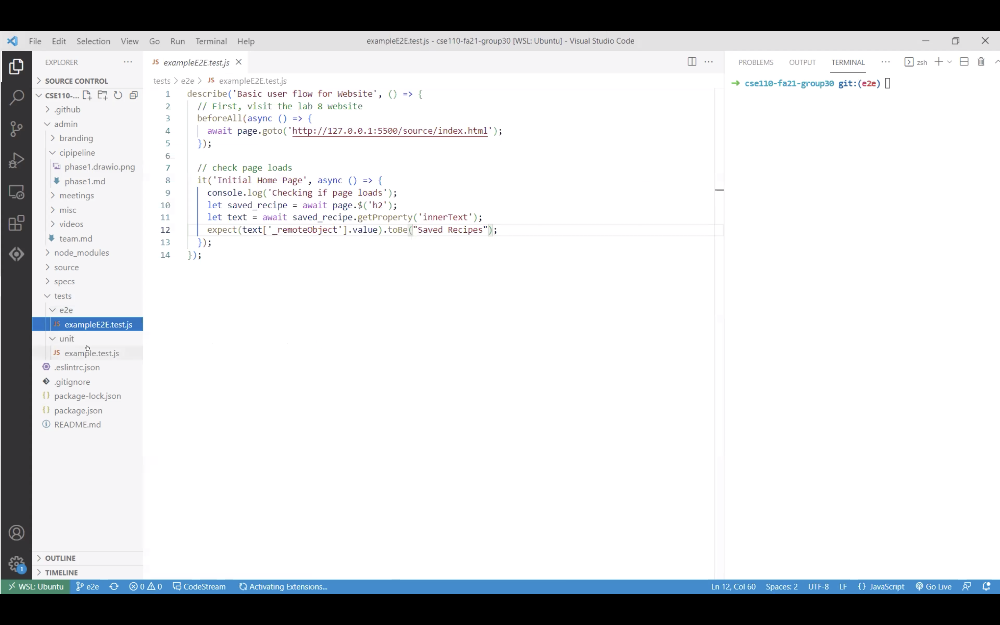
        - 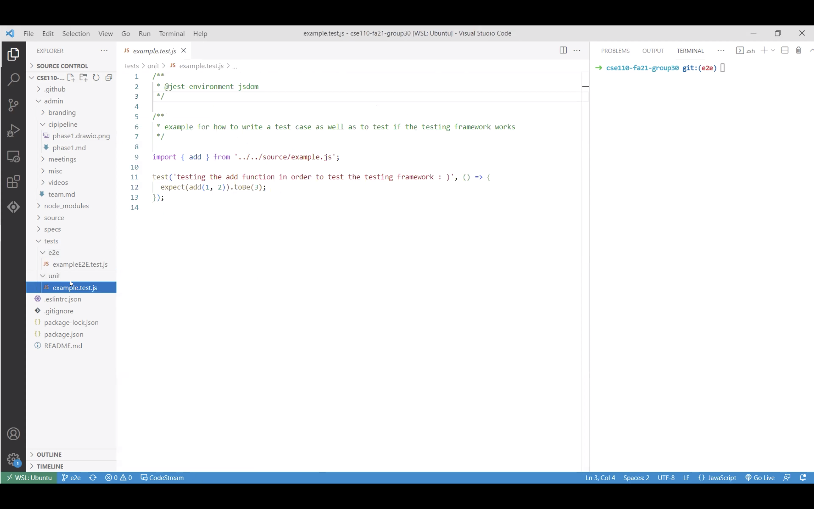
        - 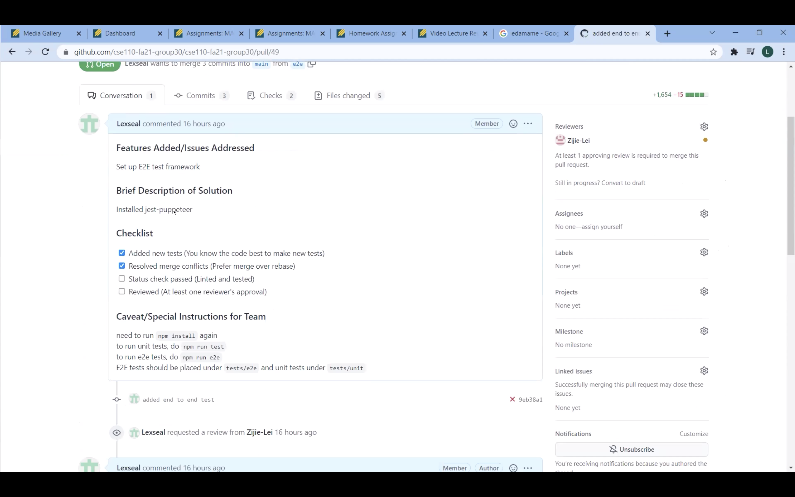
        - 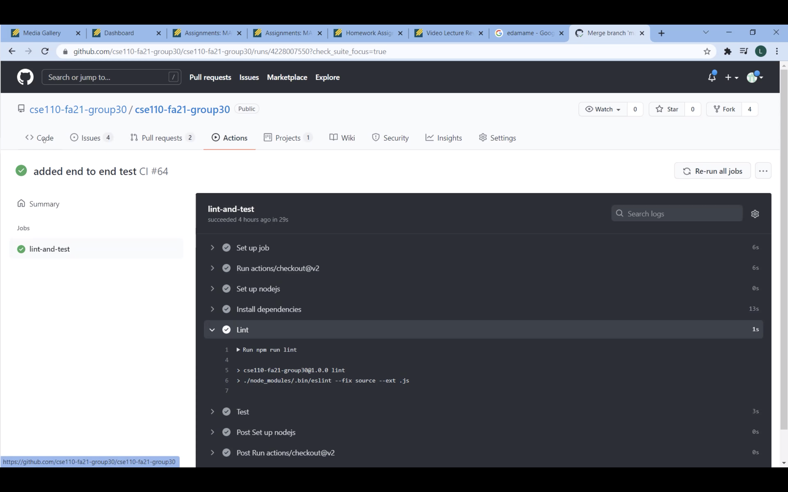
- Build components
    - Dashboard
        - Anna
            - 
    - Recipe Cards (Regular and Expanded)
        - Meshach
    - Recipe Search Page
        - Enze and Minjun
            - 
    - Recipe Detail Page
        - Jingjing and Yizhou
            - 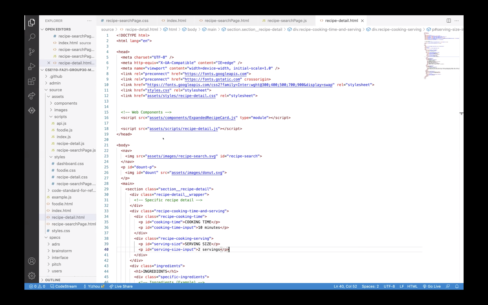
            - 
    - Foodie Mode
        - Anna and Meshach
        - Meshach: JavaScript functions
            - 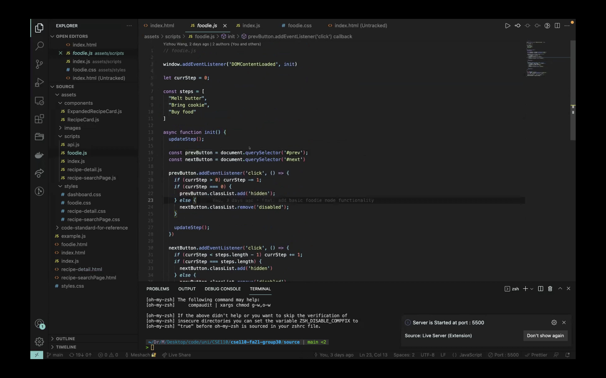
        - Anna: html and styling
            - 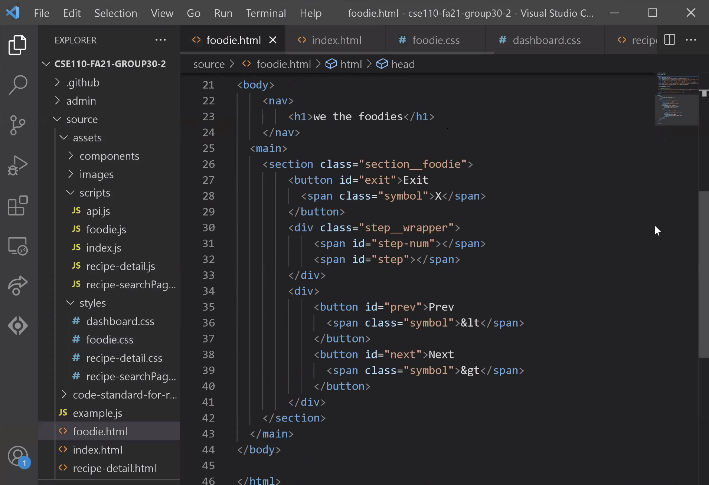
            - 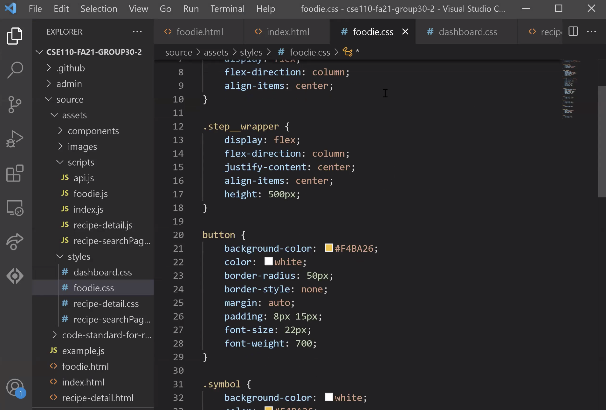
            - 
    - Navigation Bar
        - Minjun and Bin
- Data handling
    - Enze
    - fetch the recipe data by different parameters and functions that can store, remove, retrieve the data in local storage
        - 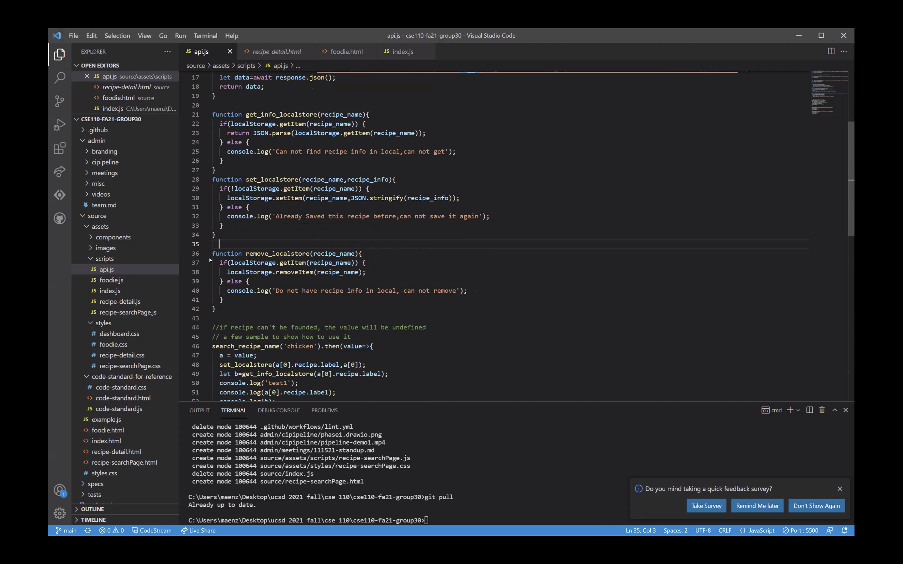
- Go through code standard
    - Yizhou
        - 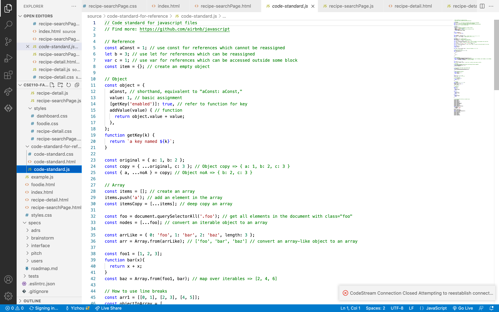
- Finalize wireframe designs
    - Prothit
        - 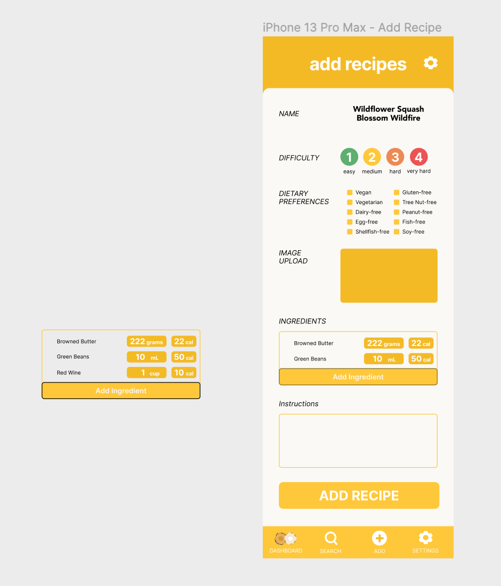
