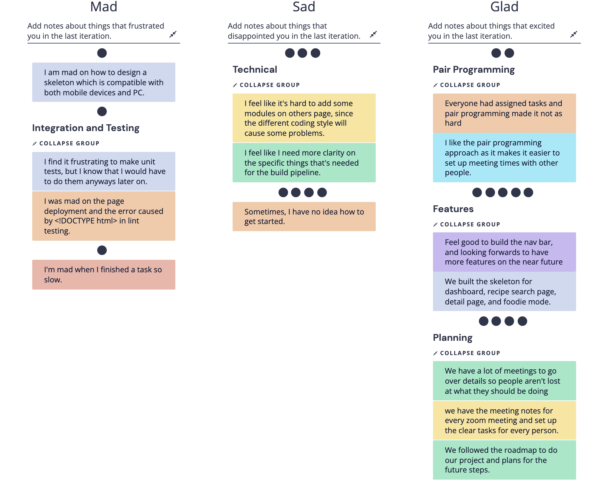
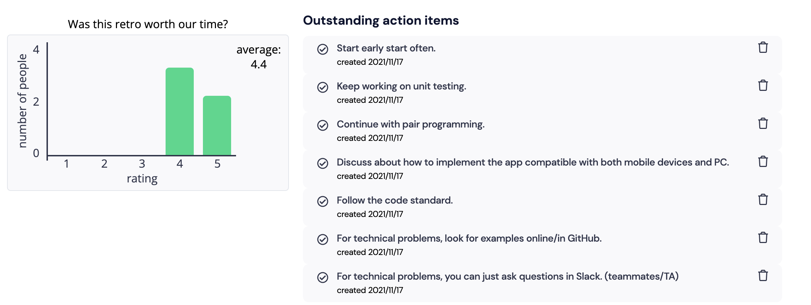

# 11/17 Retrospective
*cse110-fa21-group30*

Time: 11/17/21 1:00 - 1:55 pm

Where: Zoom

## Attendence
- Anna Hsieh
- Bin Ni
- Jingjing Qiao
- Lexseal Lin
- Meshach Adoe
- Minjun Xu
- Yizhou Wang

## Meeting Agenda
- [x] Retrospective
- [x] Go through tasks for this week
    - Coding
    - Unit Testing
    - Finalizing UI
    - Design more test cases
- [x] Distribute tasks
    - Build pipeline (Lexseal & Harry)
        - Generate Docs
        - Add some tests
    - Build components
        - Add Recipe Page (Prothit)
        - Add settings page (Minjun)
        - Providing Structured Recipe Data (Lexseal)
        - Onboarding Page (Minjun)
    - Testing (Who did the js, who writes the test)
        - api.js (Enze)
        - foodie.js (Meshach)
        - index.js (Anna)
        - recipe-detail.js (Yizhou & Jingjing)
        - recipe-searchPage.js (Minjun & Enze)
        - Add Recipe Page (Prothit)
        - Add settings page (Minjun)
        - Onboarding Page (Minjun)
        - Navigation bar (Minjun & Bin)
    - Integrate pages with data handling functions
        - Enze & Meshach
    - Team Status Video
        - Yizhou, Harry, Meshach

## Tasks Completed
- Did the retrospective meeting
    - 
    - 
- Delegated tasks between team members

## Decisions Made
- Tasks should be completed next Monday.
