# 12/2 Sprint 2 Review
*cse110-fa21-group30*

Time: 12/2/21 12:30 pm - 1:07 pm

Where: Zoom

## Attendence
- Anna Hsieh
- Bin Ni
- Enze Ma
- Harry Lei
- Jingjing Qiao
- Lexseal Lin
- Meshach Adoe
- Minjun Xu
- Prothit Halder
- Yizhou Wang

## Meeting Agenda
- [x] Sprint 2 Review

## Tasks Completed
- Build pipeline
    - Harry: Codacy, lint
        - 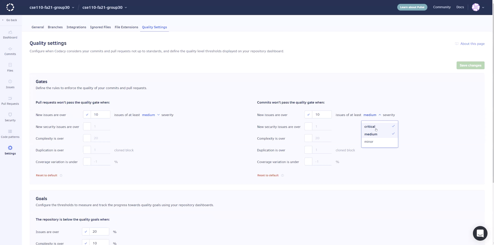
    - Harry & Lexseal: Generate Doc
        - 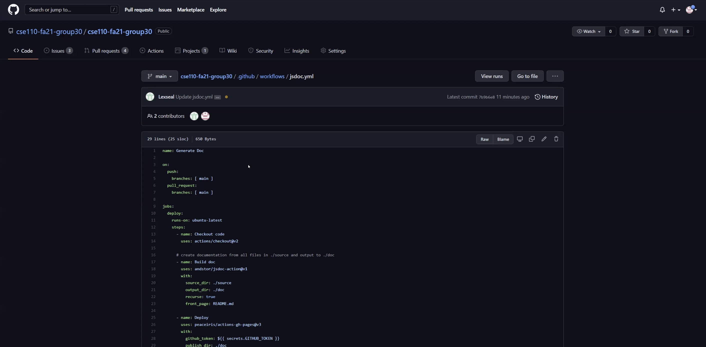
    - Harry: add some E2E tests
- Frontend
    - Onboarding page
        - Minjun
    - Dashboard
        - Anna: tests
            - 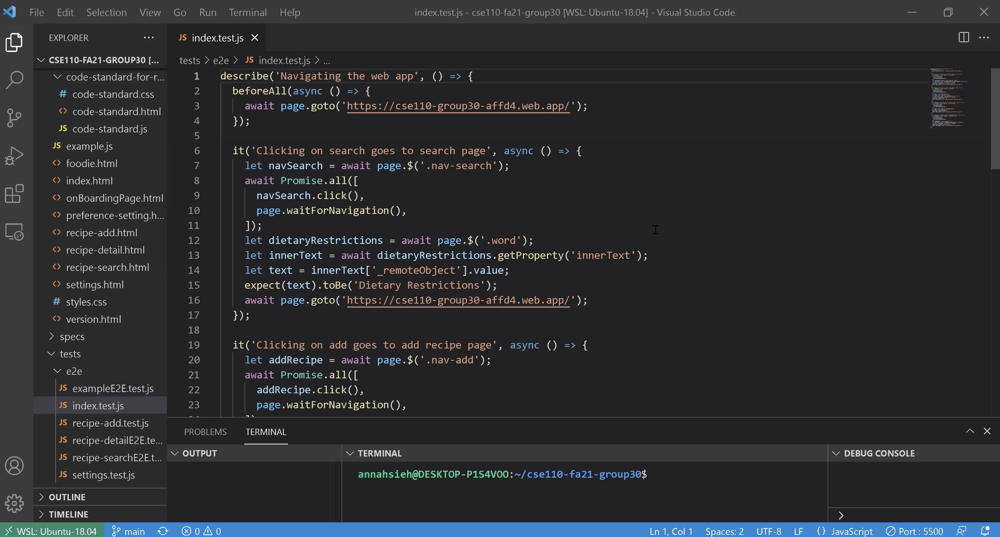
    - Recipe Detail Page
        - Jingjing: tests & documentation
            - 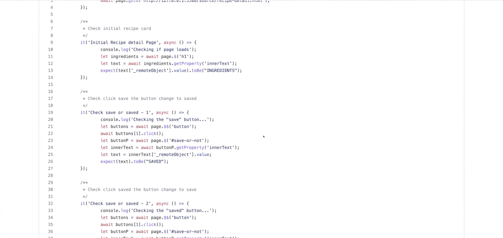
        - Yizhou: add tests
            - 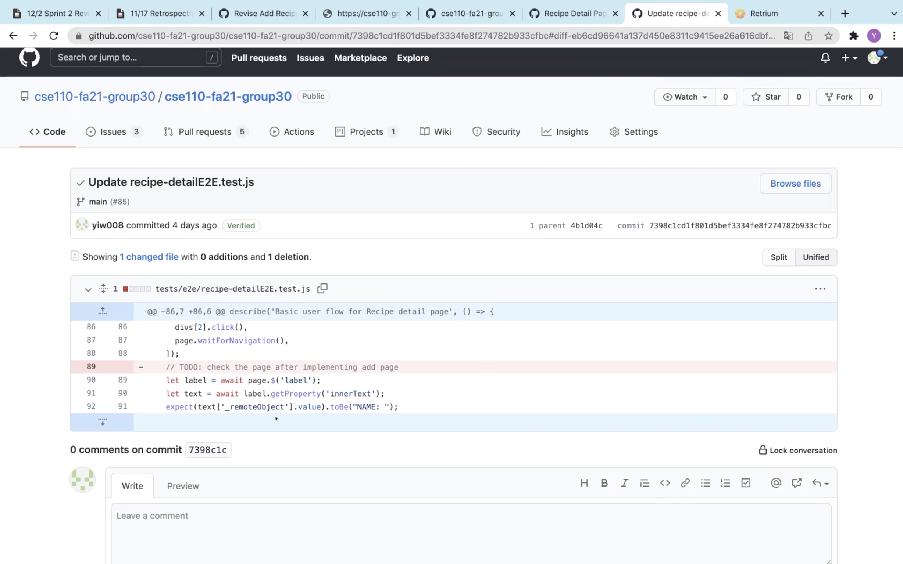
    - Foodie Mode
        - Meshach: tests
    - Add Recipe Page
        - Prothit: build the page
        - Yizhou: revise style, delete feature, tests & documentation
            - 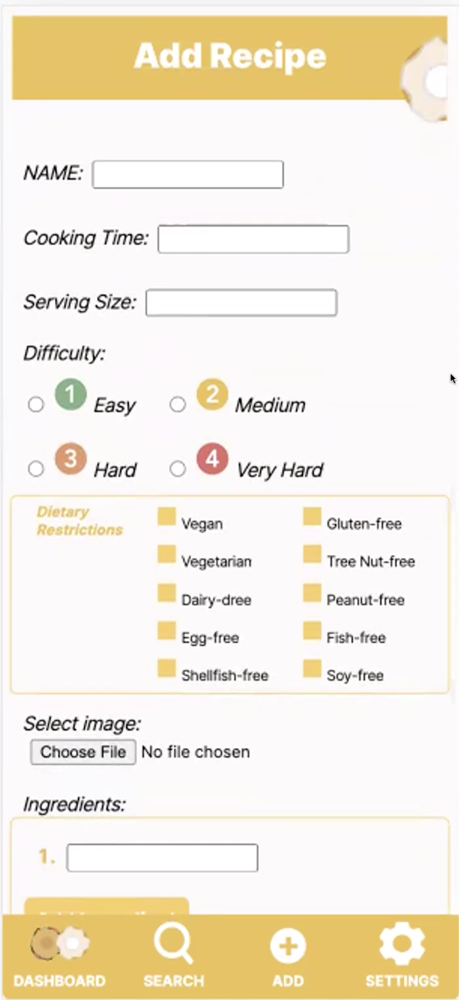
            - 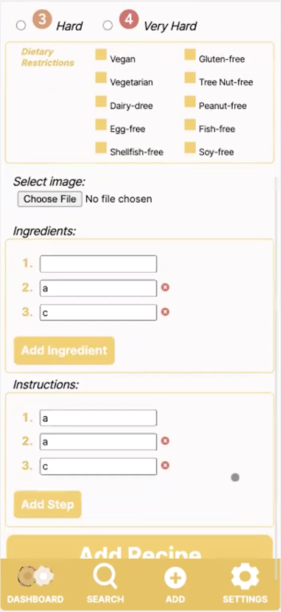
            - 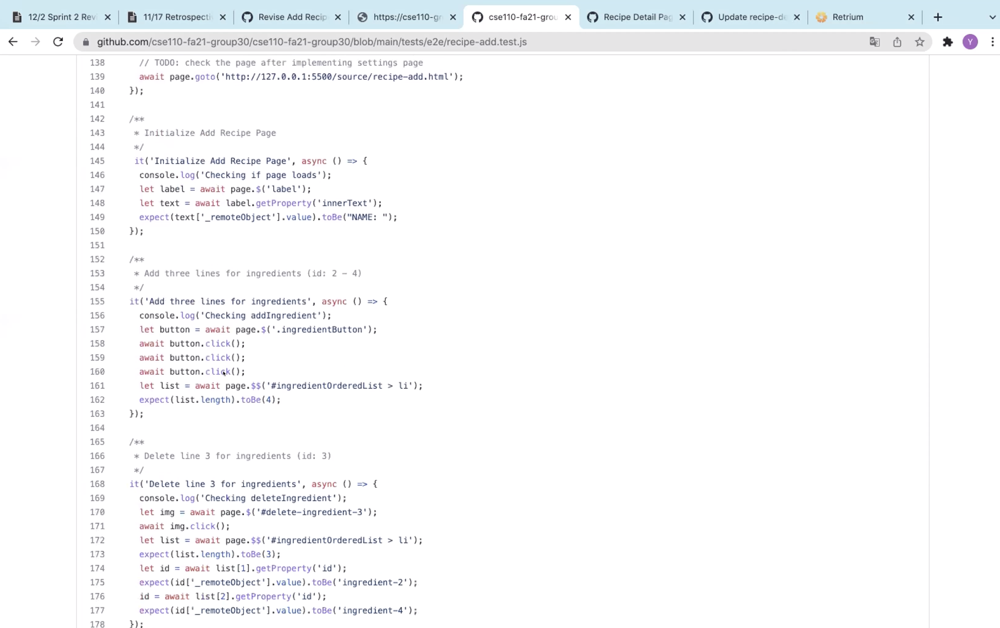
    - Settings Page
        - Minjun
            - 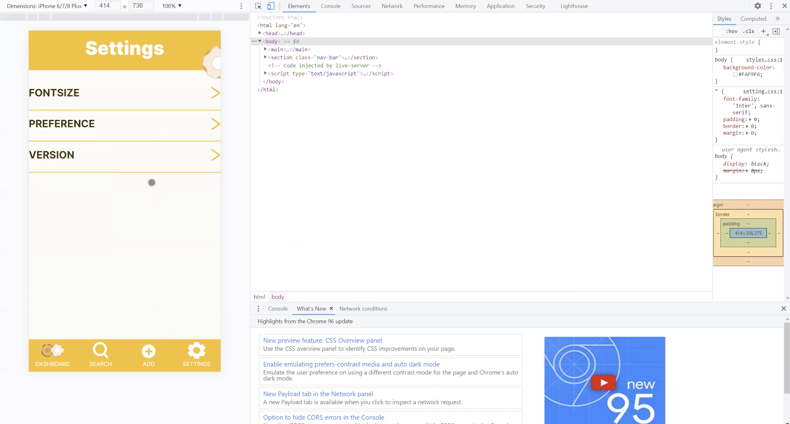
    - Navigation Bar
        - Minjun, Bin
            - 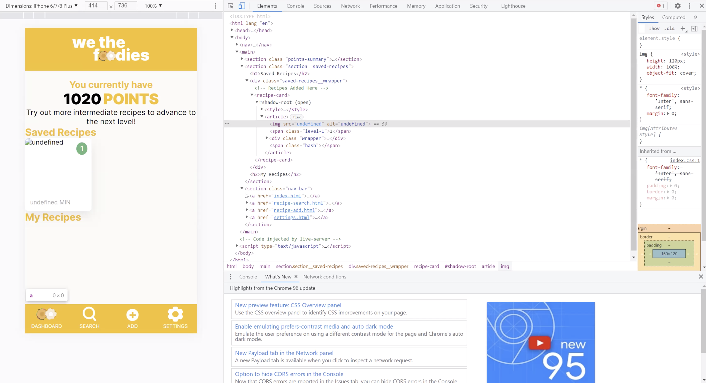
    - Remove white space on the top of the page
        - Minjun, Bin
- Backend
    - Minjun: local storage for preferences, intolorance
        - 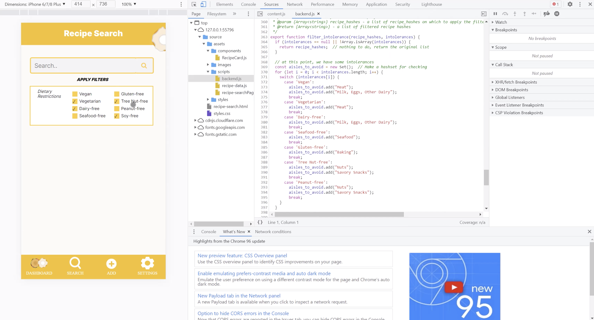
    - Lexseal: search feature, handling the backend data, fuzzy match
        - 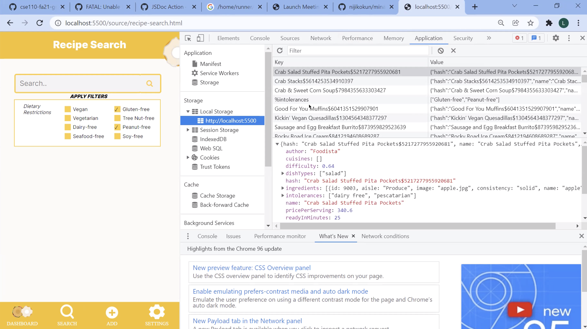
        - 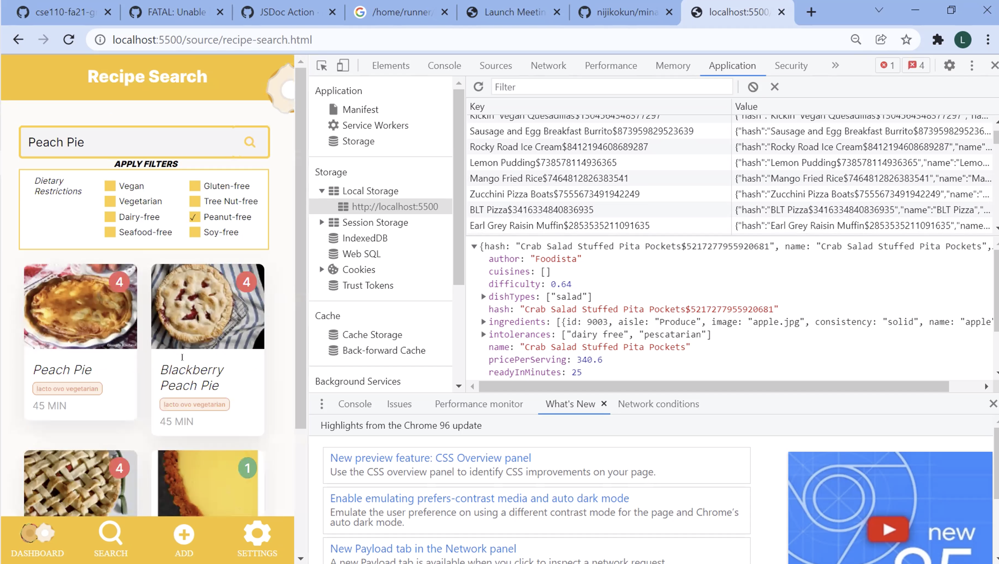
    - Prothit: add recipe feature
        - 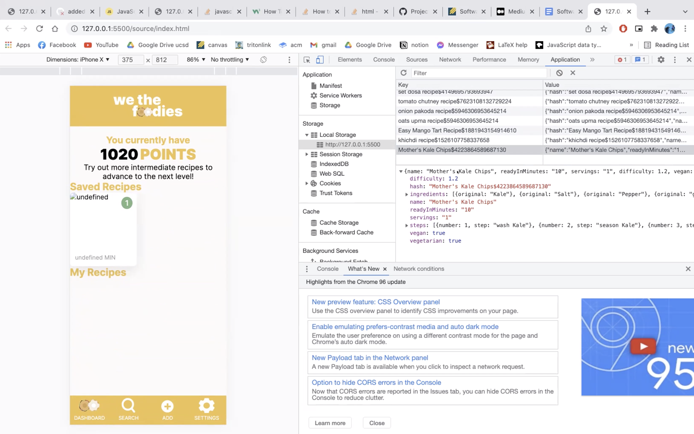
    - Enze: add more functions, implement search function
        - 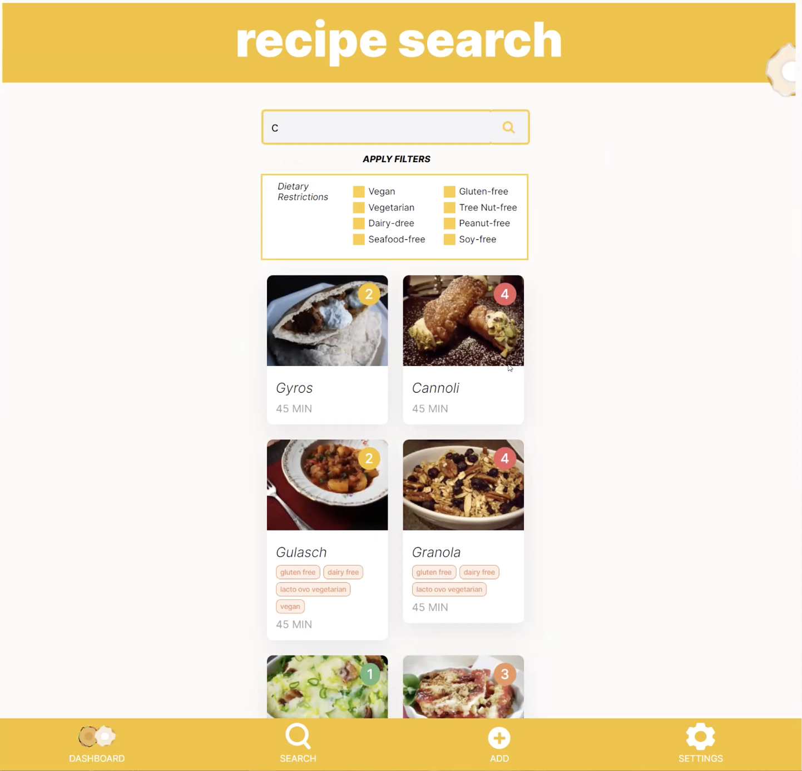
    - Meshach: save recipe feature, connect recipe search and recipe detail, foodie feature
        - 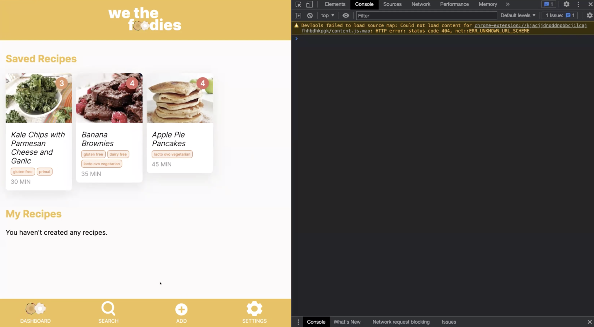
        - 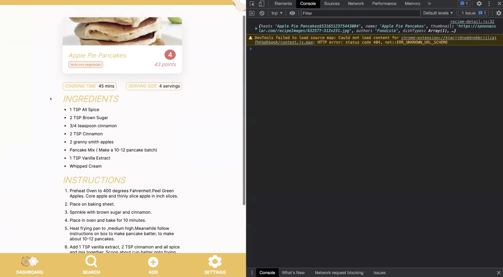
        - 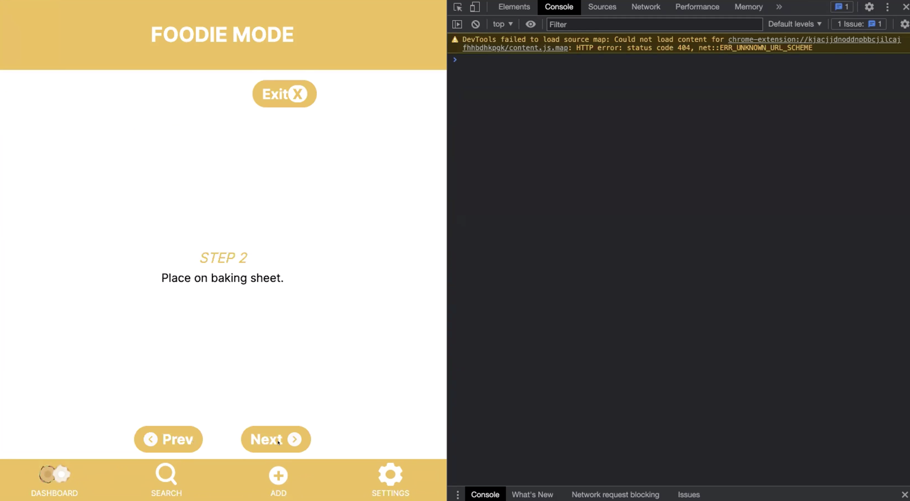
